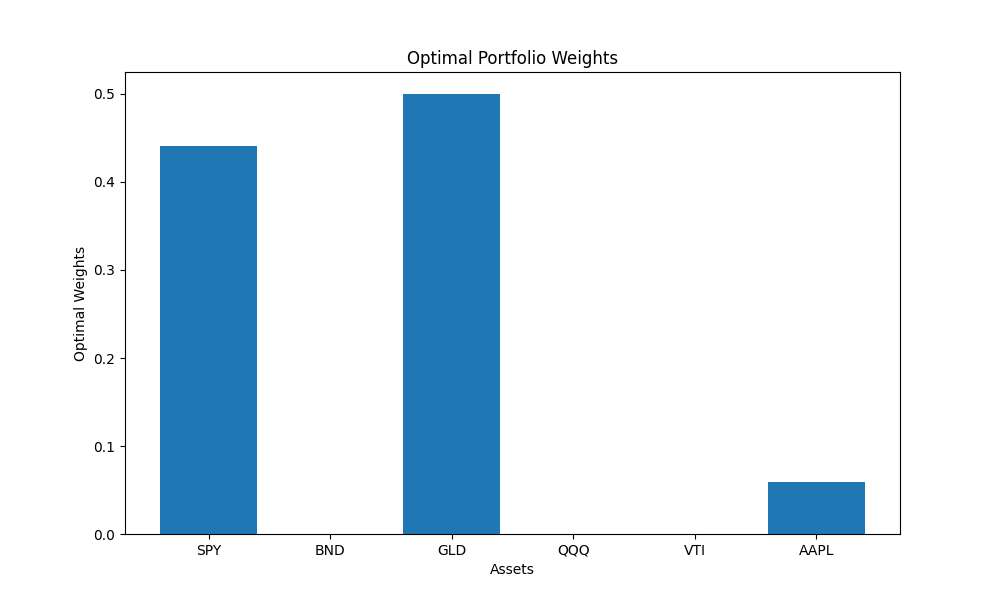
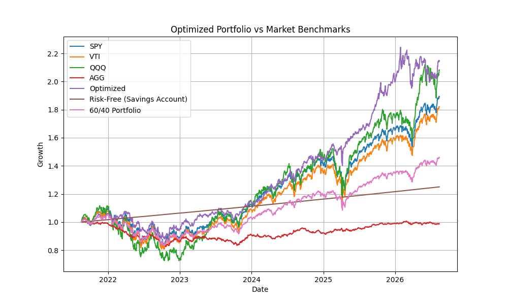

Project README

# Portfolio Optimizer

## Description 
This Python program uses mean-variance optimization to find the distribution of a customizable portfolio that maximizes the Sharpe Ratio, then compares it against alternative strategies and market benchmarks using key risk/return metrics.

## Features
- Downloads 5 years of historical price data for a customizable list of tickers
- Calculates optimal portfolio weights that maximize the Sharpe Ratio using mean-variance optimization
- Compares this against two alternative strategies: maximum return and minimum volatility 
- Benchmarks the optimized portfolio against individual market ETFs (SPY, VTI, QQQ, AGG), a 60/40 portfolio, and the risk-free rate (10-year Treasury yield) 
- Calculates key performance metrics for every strategy: expected return, volatility, Sharpe Ratio, max drawdown, and Calmar Ratio 
- Saves all results as PNG plots and CSV files

## Tech Stack
- **Python 3.9**
- **yfinance** : historical market price data
- **fredapi** : 10-year Treasury yield (risk-free rate) from the Federal Reserve
- **pandas** : data manipulation
- **numpy** : numerical calculations
- **scipy (optimize)** : SLSQP optimization to solve for optimal portfolio weights
- **matplotlib** : visualizations of portfolio weights, growth, and benchmark comparisons
- **python-dotenv** : loads the FRED API key securely from a local `.env` file
- **datetime** : sets the 5-year historical data window
- **os** : creates the results folder and saves output files

## Setup
**Clone repository**
```
git clone https://github.com/ivykelly/portfolio-optimizer.git
cd portfolio-optimizer
```

**Create and activate a virtual environment**
```
python3 -m venv .venv
source .venv/bin/activate
```

**Install dependencies**
```
pip3 install -r requirements.txt
```

**Set up FRED API key**
**Get a free API key from [FRED](https://fred.stlouisfed.org/docs/api/api_key.html)**
```
cp .env.example .env
```

**Open `.env` and replace the placeholder with your real key**
```
FRED_API_KEY=your_actual_key_here
```

**Run the program**
```
python3 Portfolio_Optimization.py
```

**Results (plots and CSVs) will be saved to the `results/` folder**

## Sample Output 
**Optimal portfolio weights (Max Sharpe)** 
 

**Optimized portfolio vs. market benchmarks** 
The optimized portfolio compared against individual ETFs (SPY, VTI, QQQ, AGG), a 60/40 portfolio, and the risk-free rate over the 5-year window. 


## Results and Analysis
After running the optimization, the maximum-Sharpe portfolio produced a significantly higher annualized return than most of the benchmarks considered (15.16%), exceeded only by the portfolio optimized solely for maximum return (16.14%). However, the maximum-Sharpe portfolio achieved this return with lower volatility (13.69% compared with 17.22%). As expected, the minimum-volatility portfolio had the lowest volatility of the three optimized portfolios (8.26%), but at the cost of much lower returns (7.19%). Interestingly, SPY and VTI exhibited volatility comparable to the maximum-return portfolio while generating significantly lower annualized returns. These results illustrate the benefit of evaluating investments using risk-adjusted metrics rather than return or volatility alone. 

The Calmar Ratio provides a slightly different perspective. The maximum-return portfolio achieved the highest Calmar Ratio at 0.852, compared with 0.823 for the maximum-Sharpe portfolio. This shows that the portfolio with the highest Sharpe Ratio does not necessarily have the highest return relative to its maximum drawdown. Although the maximum-return portfolio experienced slightly higher volatility and maximum drawdown, this was compensated for by its higher return when measured by the Calmar Ratio.

It is therefore useful to consider multiple risk-adjusted metrics when evaluating an investment strategy, rather than relying on a single measure. Two metrics can favour different portfolios while still providing distinctively insightful perspectives on performance. In this case, the Sharpe Ratio provides a broad assessment of return relative to volatility, while the Calmar Ratio provides additional insight into the portfolio's performance relative to its largest historical loss.

## Future improvements
- Implement a rolling, out-of-sample Sharpe Ratio to visualize how risk-adjusted performance changes over time
- Add more optimization objectives
- Backtest performance across different historical periods